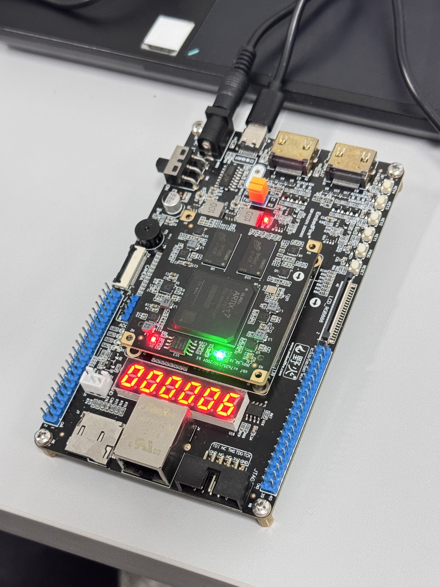

## 技术细节

### rx_uart 模块

单次接收 1 个 Byte（8 bits）

* rx：输入串行数据线。
* bps_cnt：波特率计数，记满 5208 个周期后，波特率计数器清零。
    * 计满后 end_bps_cnt 会出现一个持续一周期的脉冲信号，表示波特率计数器计满一位。

#### 特色设计：

* **bit_cnt：位计数，这里我们并没有使用常量 10 作为计数最大值，我们的 bit 级数最大值会在状态切换时改变。表示当前状态下要接收的位数。**
    * 当状态 state 为 START 时，bit_cnt 最大值为 1
    * 当状态 state 为 DATA 时，bit_cnt 最大值为 8
    * 当状态 state 为 STOP 时，bit_cnt 最大值为 1。
    * 最大值保存在 bit_max 寄存器中。
    * 计满后，end_bit_cnt 会出现一个持续一周期的脉冲信号。

* **bit_cnt_take：取位记数器，目的是要在每个周期的 1/2 处取样数据线，采样更加稳定**
    * bit_cnt_take 的初始值（initial 块）即为 1/2 个周期，这样就可以使 end_bit_cnt_take 的脉冲早于 end_bps_cnt 脉冲 1/2 个周期。

* **rx_data 和 rx_ready 同步变化：当 rx_ready 为高电平即表明 8 bits 数据已经被放到了 8 位的数据线上。**

#### 问题一：

* 最初 end_bit_cnt 和 end_bps_cnt 都是线网数据类型，并且我使用它们的上升沿作为 always 块的触发条件，这就导致微时序问题非常严重，后来我把它们改为了寄存器类型，并使用 if 条件判断和计数器产生脉冲，这样问题也就解决了

#### 问题二：

* 这里遇到的问题就是位取样的问题，最开始我们在每个周期末取样，但是发现这样取样的数据有错，后来我们干脆放弃微调时序，直接改为每个周期的 1/2 处取样，问题也就随之解决。

### ctrl_uart 模块

* 主要的控制模块，实现：
    1. 逐 Byte 调用 rx_uart 模块接收数据，共接收 4 Bytes
    2. 接收完成后进行除法运算
    3. 后依次向 tx_uart 模块发送 4 Bytes 数据。

* rx_done, d_done, tx_done：接收、除法、发送所有位全部完成信号。
* rx_data, d_data, tx_data：接收、除法、发送数据。
* rx_ready, tx_ready：每位的接收、发送完成信号。
* y_to_led：发送给 led_encoder 模块的除发器的运算结果

#### 特色设计：

* tx_state：为实现逐 Byte 发送 4 Bytes 数据，我们使用了一个状态机 tx_state，每发送完成一 Byte 数据后，状态机会自动切换到下一个状态，表明下一发送周期中要发送下一位。
    * 这里要发送的数据为 02 00 8D 00

### tx_uart 模块

* 思路和 rx_uart 模块大致相同，bit_max 同样可变。这里不做过多解释。

### led_encoder 模块

* 晶体管编码模块，将传递的数据显示到 6 位每位 7 个晶体管上。
* out：输出 7 位数据，用于驱动单位（7 个）晶体管。
* dig：位选信号。

#### 特色设计：

* 此模块内聚性极好，只需要将 6 个 4 bits 数据，共 24 bits，传递到 in\[23:0\]，数据即可显示。

### 最终效果

发送数据先发低 8 位再发高 8 位，以最后一次发送为例，被除数是 20，除数是 3，商是 6，余数是 2，所以最后显示的是 6（下图）。

